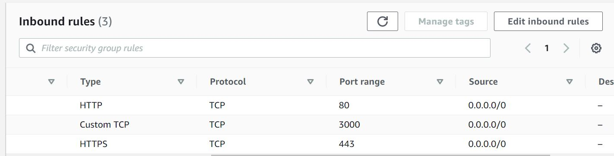
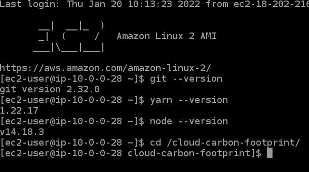
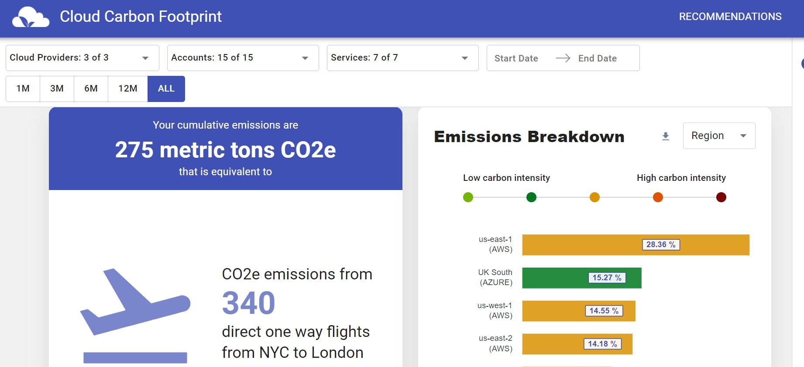
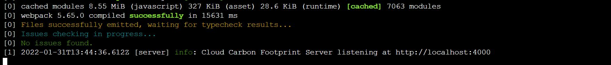
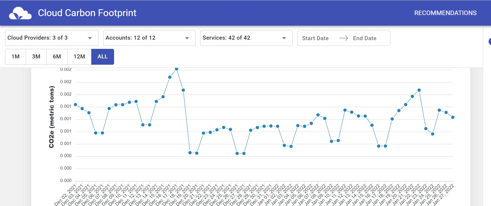

# Run CCF on EC2 :   
## Overview :  
This workbook is a stepthrough for provisionning an EC2 with the Cloud Carbon Footprint (CCF) application installed.  

## Pre-conditions  
- You have credentials to access the AWS Console for your account.  
- The subnet that will contain your EC2 has a route to an internet gateway  
- The security group of your EC2 has the following inbound rules :  

  

## Steps  
### Step 1 (optional) - Create a VPC with a public subnet with an access to the internet  
If your [VPC](./cloudformation/network-CCF.yml) hasn't been set up, you will need to create a stack with the following ressources :  
A VPC, a subnet, a route table and an internet gateway.

### Step 2 - Launch an EC2 instance within your vpc with user data script  
Once your network is setup, you will provision an EC2 with user data that is installing the packages required and the Cloud Carbon Footprint application.  
You will connect to the EC2 using SSM.  
Therefore you need to implement to your [EC2](https://github.com/reply-fr/ccf-on-aws/blob/y.flourac/cloudformation/ec2-ccf2.json) an instance role that allow you to manage SSM.  
  
### Step 3 - Test your CCF application with mock data  
#### Connect to your EC2 instance (using SSM).  
Your cloud-carbon-footprint folder as well as Git, node and Yarn should be downloaded with the previous steps.  
Double check if everything is in place using :  
```
sudo -s
yarn --version
git --version
node --version
```
This should return the versions of Git, Nodejs and Yarn  



#### Change your directory to the cloud-carbon-footprint folder and use the command : yarn start-with-mock-data.
```
cd /cloud-carbon-footprint
yarn install
yarn start-with-mock-data
```
The application should now run on port 3000

#### Open your browser and enter the following adress "yourec2publicipadress:3000"
You should see the following :  



Caution, Your ip adress will change everytime you reboot your EC2, if you want to avoid it, use an elastic ip adress.

### Step 4 - Enable Cost and Usage Report (CUR)
The CCF application is based on your AWS bills, this involve the set up of CUR (Cost and Usage report) on AWS.
This data will then be queried by Amazon Athena for the CCF usage.
Before enabling CUR you will need to create two [S3 buckets](https://docs.aws.amazon.com/AWSCloudFormation/latest/UserGuide/aws-resource-s3-bucket.html) to store the CUR data and the athena queries for CUR.  

Then navigate to your account's billing section, and click on the "Cost and Usage Reports" tab. 
Make sure to select “Amazon Athena” for report data integration.
The CUR data will be up one day after the creation of it.

### Step 5 (optional) - Synchronize your original S3 bucket with a S3 bucket of the destination account
The point of deploying CCF is to observe the Cloud Carbon Footprint from all the accounts of your organization.
We have then an issue if the account where the CUR of all your organization lives is different from the account where you want to deploy your CCF app (e.g. : if your master account is generating your CUR data from all your organization and you want to deploy your app in your Audit account).

A work around idea is to copy the CUR S3 bucket from the master account to another S3 bucket on your destination account and sychronize the two buckets :
- Modify [S3 bucket policy](./cloudformation/s3CURcross.yml) where the CUR lives to allow the target account to have its access.

- Edit the [bucket replication](https://docs.aws.amazon.com/fr_fr/AWSCloudFormation/latest/UserGuide/aws-properties-s3-bucket-replicationrule.html) rule of your master CUR S3 bucket.

### Step 6 - Create an IAM user with the permissions to assume a role and a role to access and query CUR data
You will need a user that have an access to both of the s3 buckets (the one where the CUR data lives and the one where athena queries are stored) as well as an access to Athena.  
To achieve this your USER will have the permission to [assume a role](./cloudformation/assumerole.yml)  

You will then need to create a role to have access to the s3 buckets and to some Athena actions.  

The trusted entities in the template of your [IAM role](./cloudformation/ccf-app-role.yml) must be your IAM user ARN.  

### Step 7 - Assume the role
- Connect to your IAM USER within your EC2 using the AWS Access Key ID and the secret access key that AWS provided when creating your IAM User, using AWS CLI :  
```
aws configure
```
- Assume the role with AWS CLI :  
```
aws sts assume-role --role-arn "arn:aws:iam::ACCOUNTID:role/YOUR-ROLENAME" --role-session-name AWSCLI-Session
```
You will then obtain several identification for this IAM role RoleAccessKeyID, RoleSecretKey, and RoleSessionToken.  
- Create several environment variables and fill these with the previous output :  
```
export AWS_ACCESS_KEY_ID=RoleAccessKeyID
export AWS_SECRET_ACCESS_KEY=RoleSecretKey
export AWS_SESSION_TOKEN=RoleSessionToken
```
- Verify that you assumed the IAM role  
```
aws sts get-caller-identity
```

### Step 8 - Install the app with the correct configuration
You will need to set up your configuration, you have two choices either use the guided install :  
```
sudo -s
cd /cloud-carbon-footprint
yarn guided-install
```
You will then have to enter your AWS Account ID, your AWS Athena Region, your role name, the Athena DB name, the Athena Table name and the S3 bucket for Athena queries.  
Or you can manually change your config on the /packages/cli/.env and /packages/api/.env files.  

### Step 9 - Run CCF with the CUR data
From the cloud-carbon-footprint folder, launch the app  
```
cd /cloud-carbon-footprint
sudo yarn start &
sudo systemctl start nginx.service
```
Once your console shows the following message :  


Your CCF app should be running on your browser at the ip : *"YOUREC2PUBLICADRESS:3000"*  


### Step 10 (optional) - Run CCF with the CUR of your own account on a docker container, on the EC2
You can also run your CCF app on a Docker Container, here are the steps to do so
-  On your EC2 command line switch to root user and update yum  
```
sudo -s
yum update -y
```
- Install docker  
```
yum install docker
```
- Start the docker service  
```
service docker start
```
- Pull the docker image  
```
docker pull cloudcarbonfootprint/api
```
- Run the container  
```
cd /cloud-carbon-footprint
docker run --env-file packages/api/.env --env GOOGLE_APPLICATION_CREDENTIALS=/root/.config/gcloud/service-account-keys.json -p 4000:4000 -v $HOME/.aws/credentials:/root/.aws/credentials -v $HOME/.config/gcloud/service-account-keys.json:/root/.config/gcloud/service-account-keys.json cloudcarbonfootprint/api
```
- List the containers to see if it is running  
```
docker container ls
```
Open your browser and enter the following adress *"YOUREC2PUBLICADRESS:3000"*.  
You should see the Cloud Carbon Footprint app running with your own AWS billing data
